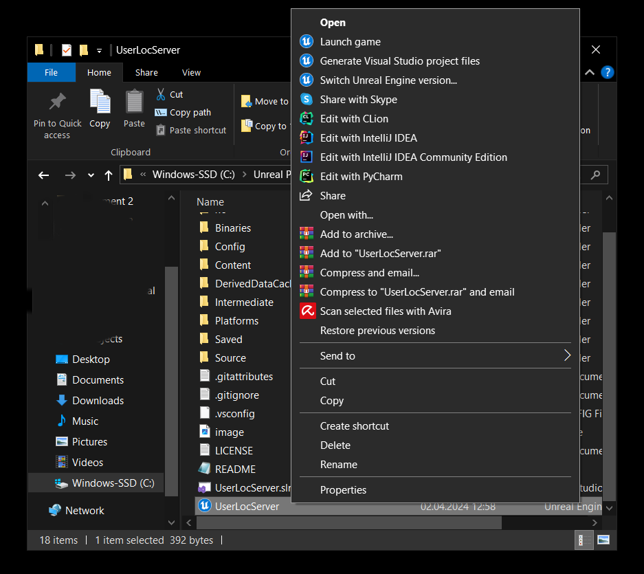
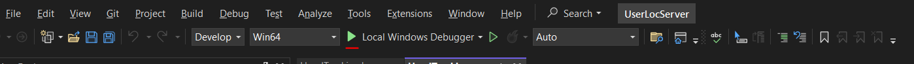
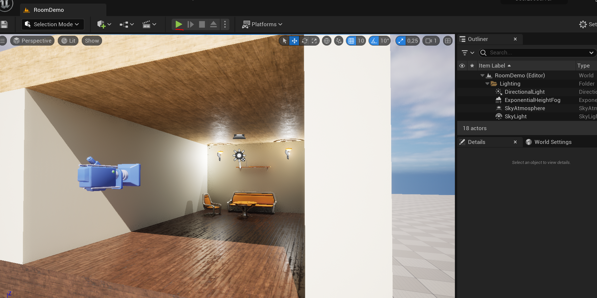
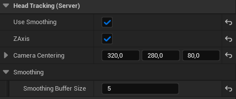
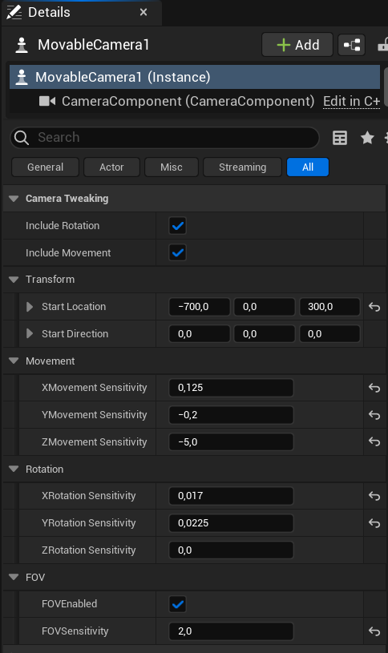
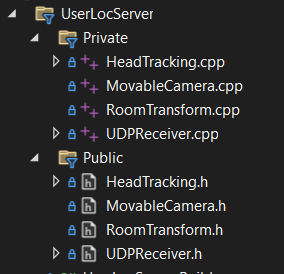

<div align="center">
    <h1>Unreal Engine Face-tracking Client</h1>
    <i>A repo by: Kjetil Indrehus, Sander Hauge & Martin Johannessen</i>
</div>

<div align="center">
    <br />
    <a href="https://www.unrealengine.com/en-US/blog/unreal-engine-5-2-is-now-available">
        
    </a>
</div> <br />

An Unreal Engine 5 project which utilizes coordinate data sent by a local server to change a virtual camera in a virtual environment.
Requires a local server sending coordinate data in the encoded string format: 'X, Y, Z'

# Project Description

> This repository represents a component of the software for the thesis "User-face tracking for Unreal Interface". The thesis is authored by Martin Hegnum Johannessen, Kjetil Karstensen Indrehus, and Sander Tøkje Hauge. Feel free to see to checkout the [Github Organization created for the thesis](https://github.com/RIT-NTNU-Bachelor)

The aim of this repository is to create a realistic feeling of looking through a window, utilizing UE to achieve this. Several factors is important to make this possible, which will be mentioned later. The client has been developed using Unreal Engine 5.2.1, other versions has not been tested, but should work with older and newer versions.

This project includes:

- UE basic starter content, where materials and props have been utilized.
- Umap: room-demo, used for demonstrating the effect.
- Uassets: simple models used in the demo map.
- Custom actor components to connect to a face tracking server.
- Pawn as the movable camera component, which uses the custom actor components.

Unreal Engine was utilized to acheive this effect as it has existing features necessary for making the realistic effect. Modelling, world transformations and C++ language inclusion among others. It is important to note that the project was made with no previous knowledge of UE and little-to-none using C++. Therefore, some code standards may not be met, as well as code quality may see some improvements.

> This repository uses Git LFS for the .umap and .uasset files.

### Table of Contents

**[Requirements](#Requirements)**<br>
**[Installation](#Installation)**<br>
**[Usage](#Usage)**<br>
**[Credits](#Credits)**<br>
**[License](#License)**<br>

## Requirements

To successfully open and run the project the following must be downloaded:

- Visual Studio 2022 with Game engine package.
- Unreal Engine 5.2.1 or newer.
- A server sending XYZ coordinates, the existing python server may be used: [OpenCV_Server](https://github.com/RIT-NTNU-Bachelor/OpenCV_Server/tree/main).

## Installation

Follow this step-by-step guide to get the project up and running:

### Step 1 - Clone repository

Using your terminal of choice. For example git bash, run the following command:

```
git clone https://github.com/RIT-NTNU-Bachelor/Unreal-facetracking-client.git
```

Alternatively use GitHub Desktop, File->Clone Repository.

- Insert URL: https://github.com/RIT-NTNU-Bachelor/Unreal-facetracking-client.git.
- Select local path.
- Press "Clone".

### Step 2 - Open and build

To open and build the project you may do it in two ways:

- **Launch using Unreal Engine.**

1. Press "Generate Visual Studio project files.
2. Press "Open"
   
   This will launch the editor and allow you to start working and using the project.

- **Launch using Visual Studio.**

1. Open the project file: UserLocServer.sln, in Visual Studio 2022.
2. Press "Run".
   
   This opens up the UE editor and allow you to start working and using the project.

- **Alternative: "Launch Game"**
  > This runs the game, and may not work as intended.

## Usage

To use the project as intended, run a server as mentioned in Requirements. Press: Run, or keybind: "Alt-P", to run the project. If a server is sending the correct data, the camera in the scene will move corresponding to the face detected.


Additionally, you may tweak and make changes to the camera and head tracking components. This may be done by selecting the camera in the scene, must be in "Selection Mode", and seeing the menus in the "Details" tab.

Here is the settings for the Head tracking (Actor component). This category is to modify server data reveived.
 <br />
**Explained:**

- Use smoothing: tells if the camera will be real time or lose some real-time to make movement smoother.
- ZAxis: enable/disable usage of the Z coordinate.
- Camera centering: the center coordinates of a face from the face tracking server. When the face is in the middle of the frame. This makes sure the XYZ coordinates are 0, 0, 0 in UE.
- Inside Smoothing (subcategory), Smoothing Buffer Size: an integer telling the amount of smoothing to be added. May be 0->inf, depending on the smoothing that is desired.

Here is the settings for the Movable camera (Camera component).
 <br />
**Explained:**

- Include Rotation: enable/disable rotation of camera based on face data.
- Include Movement: enable/disable movement of camera based on face data.
- Transform: change location and direction of camera when the game is run, this must be changed not original transform.
- Movement sensitivity: separately tweak sensitivity for XYZ movement.
- Rotation sensitivity: separately tweak sensitivity for XYZ rotation. Z rotation sensitivity should be 0 (zero).
- FOV: enable/disable FOV and set the sensitivity.

File structure in of the C++ part of the UE project: <br />


## System Description

The system consists of two primary components: the Face Tracking server and the Rendering Engine Client. The Face Tracking Server uses OpenCV to process frames in real-time. For each frame, it detects the position of the face. Once the position is ascertained, these coordinates are sent using the UDP (User Datagram Protocol) to ensure fast and efficient transmission. The Rendering Engine Client then takes over by parsing the received coordinates. Using this data, the engine re-renders the scene to align with the new position of the face. This cycle of detection, transmission, and rendering continues seamlessly with each frame, allowing for a responsive and dynamic integration of face tracking data with the rendered content: 


## Credits

The tutorial from CVZone, has been used to further progress the project. It involves corresponding movement from face tracking coordinates into Unity. Big changes has been made, but core principles from CVZone is used. Link: [3D Headtracking with car movement](https://www.computervision.zone/courses/3d-head-tracking-with-car-movement/)

## License

[MIT](https://github.com/RIT-NTNU-Bachelor/Unreal-facetracking-client/blob/master/LICENSE)
